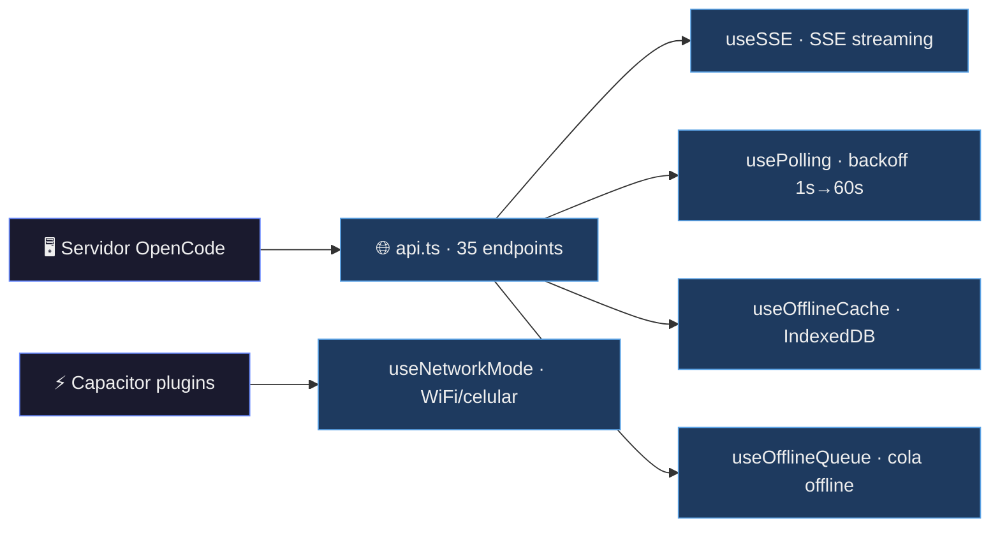
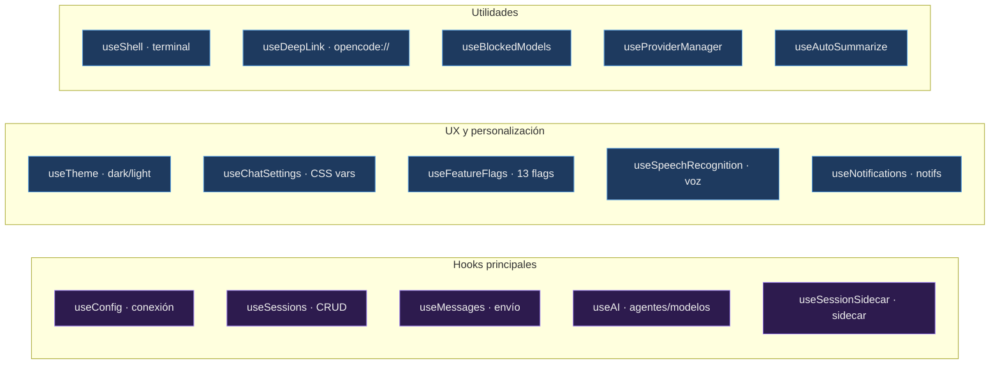
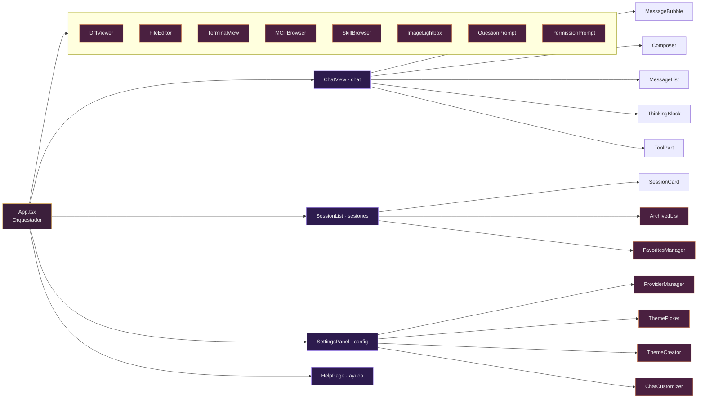
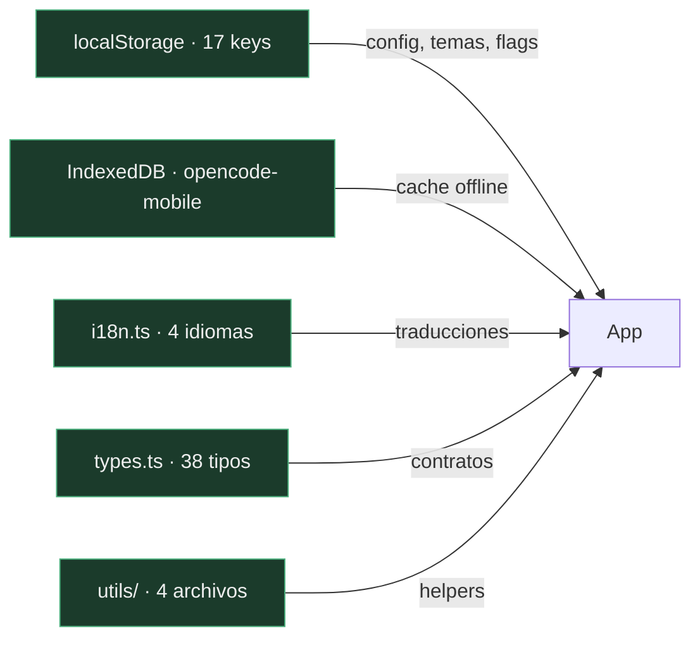

# ⚡ OpenCode Mobile — Catálogo de Funcionalidades

> **Cliente Android para [OpenCode](https://opencode.ai)** — asistente de codificación AI desde el celular.
> React 18.3 + TypeScript 5.6 + Vite 8 + Capacitor 8. 47 componentes, 27 hooks.

---

## 📡 Transporte y Conectividad

| Funcionalidad | Archivo | Descripción |
|---|---|---|
| **SSE Streaming** | `useSSE.ts` | EventSource sobre GET `/event`. Eventos: `message.updated`, `message.part.delta`, `message.part.updated`, `session.error`, `session.status`, `server.heartbeat`. Heartbeat timeout 35s, reconexión exponencial 1s→30s con jitter. Solo activo cuando `dataMode === "full"` y `flags.streamingFull === true` |
| **Polling adaptativo** | `usePolling.ts` | Backoff exponencial (1s→60s, ±30% jitter). 4 modos: Full (3.5s), Saver (15s), Ultra (30s), Miser (60s). Pausa/reanuda según estado SSE (`streamActive`). Reconexión automática |
| **Cache offline** | `useOfflineCache.ts` | IndexedDB (`opencode-mobile`, v1, stores: sessions, messages). Cachea sesiones y mensajes. Búsqueda full-text sobre mensajes cacheados. Navegación offline completa de datos históricos |
| **Cola offline** | `useOfflineQueue.ts` | IndexedDB store `pendingActions`. Encola prompts, comandos y shell cuando `connectionState === "offline"`. Reenvía todo al reconectar (`connectionState === "connected"` → `dequeueAll()`) |
| **Network mode** | `useNetworkMode.ts` | Detecta cambios de red via Capacitor Network plugin. Cambia automáticamente a `"ultra"`/`"miser"` en datos móviles, `"full"` en WiFi |

---

## 🔧 Hooks de Estado y Lógica (27 hooks)

| Hook | Archivo | Propósito |
|---|---|---|
| `useConfig` | `useConfig.ts` | Carga/guarda config del servidor (host, port, username, password). Health checks, test de conexión. Persiste `dataMode`. Maneja estados `idle`→`connecting`→`connected`→`reconnecting`→`offline` |
| `useSessions` | `useSessions.ts` | CRUD de sesiones: listar, crear, renombrar, eliminar. Polling de sesiones activas. Favoritos (localStorage). Sesión seleccionada. Búsqueda por query |
| `useMessages` | `useMessages.ts` | Mensajería: enviar prompts/comandos/shell, cargar mensajes, optimistic UI, abortar respuesta, revertir/undo. Mensajes renderizados con thinkingParts y toolParts |
| `useAI` | `useAI.ts` | Agentes y modelos AI. Carga desde `/agent` y `/config/providers`. Filtros, búsqueda. Persiste selección reciente y modelo activo. Variantes de modelo |
| `useSSE` | `useSSE.ts` | Conexión SSE con auto-reconexión, heartbeat, fallback a polling. Devuelve `streamState: "polling" \| "streaming" \| "reconnecting"` |
| `useChatSettings` | `useChatSettings.ts` | Personalización visual del chat: fontSize (10-24px), messageSpacing (compact/normal/comfortable), toggles showThinking/showToolCalls/showTimestamps. Persiste en localStorage + CSS custom properties |
| `useTheme` | `useTheme.ts` | Tema: system/light/dark/scheduled. Aplica clase CSS al `<html>`. Persiste preferencia |
| `useFeatureFlags` | `useFeatureFlags.ts` | 13 feature flags booleanas + threshold numérico. Persiste en localStorage |
| `useOfflineCache` | `useOfflineCache.ts` | IndexedDB cache de sesiones y mensajes para navegación offline |
| `useOfflineQueue` | `useOfflineQueue.ts` | Cola de acciones offline con replay automático |
| `useNotifications` | `useNotifications.ts` | Notificaciones browser API. Flags: onCompletion, onQuestion, onError |
| `useDeepLink` | `useDeepLink.ts` | Deep links `opencode://connect?host=...&port=...&username=...`. Llena auto la config |
| `useShell` | `useShell.ts` | Terminal: líneas de output, comando corriendo, historial, ejecución, limpieza |
| `usePolling` | `usePolling.ts` | Polling configurable con backoff. Pausa/reanuda/fail/succeed |
| `useAutoSummarize` | `useAutoSummarize.ts` | Compactación automática cuando el token count supera el threshold (default 32K) |
| `useSessionSidecar` | `useSessionSidecar.ts` | Sidecar: todos, diff files, dashboard de proyecto, VCS status |
| `useFileBrowser` | `useFileBrowser.ts` | Navegador de archivos: path, items, loading, error, navegación |
| `useFolderPicker` | `useFolderPicker.ts` | Selector de carpeta para crear sesiones nuevas. Navegación de directorios, cursor persistence |
| `useStats` | `useStats.ts` | Estadísticas de uso: prompts enviados, sesiones creadas, first used date |
| `useProviderManager` | `useProviderManager.ts` | Gestión de proveedores externos (OpenAI, Anthropic, etc.): conectar, desconectar, listar |
| `useBlockedModels` | `useBlockedModels.ts` | Set de modelos bloqueados persistido en localStorage |
| `useSpeechRecognition` | `useSpeechRecognition.ts` | Speech-to-text: Capacitor SpeechRecognition + fallback Web Speech API |
| `useCompletionAudio` | `useCompletionAudio.ts` | Audio y notificación al completar respuesta del asistente |
| `useMemoryCleanup` | `useMemoryCleanup.ts` | Limpieza periódica de mensajes stale (5 min cutoff) de sesiones no seleccionadas |
| `useFocusTrap` | `useFocusTrap.ts` | Trampa de foco para modales. Maneja Tab y Escape |
| `useBackButton` | `useBackButton.ts` | Botón físico "atrás" de Android vía Capacitor App |

---

## 🎨 Componentes UI (47 componentes)

### Layout y Navegación
| Componente | Archivo | Descripción |
|---|---|---|
| `NavBar` | `NavBar.tsx` | Barra de navegación (top o bottom) con tabs sessions/detail/settings |
| `BottomSheet` | `BottomSheet.tsx` | Panel deslizante inferior con detalle de agente/modelo de la sesión actual |
| `ErrorBoundary` | `ErrorBoundary.tsx` | Error boundary que captura y muestra errores gracefulmente |
| `Modal` | `Modal.tsx` | Wrapper reusable con focus trap y backdrop click-to-close |

### Chat
| Componente | Archivo | Descripción |
|---|---|---|
| `ChatView` | `ChatView.tsx` | Vista principal de chat: compone MessageList + Composer + ToolStatus + sidecar |
| `MessageBubble` | `MessageBubble.tsx` | Burbuja de mensaje individual con color de agente, tokens, duración, thinking/tool parts |
| `MessageList` | `MessageList.tsx` | Lista scrollable de mensajes con auto-scroll, loading, revert |
| `Composer` | `Composer.tsx` | Input de mensajes con send/stop, slash commands, historial, voz, pegar imágenes |
| `ToolPart` | `ToolPart.tsx` | Muestra tool call/results con icono, colapsable, preview de archivo |
| `ToolStatus` | `ToolStatus.tsx` | Indicador animado de herramientas ejecutándose |
| `ThinkingBlock` | `ThinkingBlock.tsx` | Bloque colapsable de razonamiento AI con duración |
| `CollapsibleSection` | `CollapsibleSection.tsx` | Sección colapsable DRY reusable (icono, título, subtítulo, filePath, chevron) |
| `Markdown` | `Markdown.tsx` | Renderiza markdown con react-markdown + GFM + syntax highlighting |
| `InlineDiff` | `InlineDiff.tsx` | Renderiza diff string con resaltado de +/-/@@ líneas |
| `DiffViewer` | `DiffViewer.tsx` | Visor de archivos diff con expandir/colapsar, apply/reject por archivo |
| `PlanBreakdown` | `PlanBreakdown.tsx` | Desglose colapsable de tareas del plan (pending/completed) |
| `SubagentFooter` | `SubagentFooter.tsx` | Footer con info de subagente y token usage |

### Sesiones
| Componente | Archivo | Descripción |
|---|---|---|
| `SessionList` | `SessionList.tsx` | Lista completa de sesiones: proyectos agrupados, recientes, activas, búsqueda, favoritos |
| `SessionCard` | `SessionCard.tsx` | Card de sesión individual con open/rename/delete/favorite/export/archive/fork |
| `SessionToolbar` | `SessionToolbar.tsx` | Toolbar: refresh, new session, data mode, settings, archive, favorites, theme creator |
| `SessionTokenUsage` | `SessionTokenUsage.tsx` | Barras de uso de tokens coloreadas (input/output/reasoning/cache) |
| `ArchivedList` | `ArchivedList.tsx` | Modal de sesiones archivadas con restore/open |
| `FavoritesManager` | `FavoritesManager.tsx` | Modal de reordenamiento de favoritos (drag + up/down arrows) |
| `InlineRename` | `InlineRename.tsx` | Input inline para renombrar sesión |

### Modales de Configuración
| Componente | Archivo | Descripción |
|---|---|---|
| `SettingsPanel` | `SettingsPanel.tsx` | Panel completo: host, port, username, password, test, providers, themes, language, flags, about |
| `ChatCustomizer` | `ChatCustomizer.tsx` | Personalización visual del chat: fontSize, spacing, toggles thinking/tools/timestamps |
| `ThemePicker` | `ThemePicker.tsx` | Selector de temas con 30+ variantes, search/filter, preview on hover |
| `ThemeCreator` | `ThemeCreator.tsx` | Editor visual de temas: 13 slots de color, presets dark/light, export JSON |
| `ProviderManager` | `ProviderManager.tsx` | Gestión de proveedores externos: lista, conectar, API key modal |
| `DataModeSwitcher` | `DataModeSwitcher.tsx` | Botones toggle para modo de datos: full/saver/ultra/miser |
| `ShortcutsModal` | `ShortcutsModal.tsx` | Referencia de atajos de teclado |
| `ConfirmModal` | `ConfirmModal.tsx` | Confirmación para eliminar sesión |

### Modales de Acción
| Componente | Archivo | Descripción |
|---|---|---|
| `FileBrowser` | `FileBrowser.tsx` | Navegador de archivos del servidor |
| `FileEditor` | `FileEditor.tsx` | Editor de archivos: leer, editar, guardar en el servidor |
| `MCPBrowser` | `MCPBrowser.tsx` | Explorador de recursos MCP con búsqueda |
| `SkillBrowser` | `SkillBrowser.tsx` | Explorador de skills del servidor con búsqueda |
| `TerminalView` | `TerminalView.tsx` | Terminal emulator: input, output, historial, clear/close |
| `ImageLightbox` | `ImageLightbox.tsx` | Visor de imágenes full-screen con zoom, pan, drag, escape |
| `FolderPicker` | `FolderPicker.tsx` | Selector de directorio para nueva sesión |
| `QuestionPrompt` | `QuestionPrompt.tsx` | Formulario estructurado de preguntas del AI (opciones, custom input, multiple choice) |
| `AutoQuestionPrompt` | `AutoQuestionPrompt.tsx` | Prompt para preguntas auto-generadas del AI |
| `PermissionPrompt` | `PermissionPrompt.tsx` | Modal de aprobación/rechazo de permisos de herramientas |

### Información
| Componente | Archivo | Descripción |
|---|---|---|
| `HelpPage` | `HelpPage.tsx` | Página de ayuda multi-tab: overview/server/network/troubleshooting/commands |
| `GitToolbar` | `GitToolbar.tsx` | Git: branch display, stage/commit |
| `ConnectionNotices` | `ConnectionNotices.tsx` | Banners de estado offline/reconnecting |
| `ContextMenu` | `ContextMenu.tsx` | Menú contextual right-click con acciones configurables |
| `ErrorNotice` | `ErrorNotice.tsx` | Mensaje de error inline |

---

## 🌐 API Layer — `api.ts` (30 endpoints)

| Método | Endpoint | Propósito |
|---|---|---|
| `health` | `GET /global/health` | Health check del servidor |
| `listSessions` | `GET /session` | Lista sesiones de un directorio |
| `listGlobalSessions` | `GET /experimental/session` | Lista todas las sesiones (cursor pagination) |
| `listStatuses` | `GET /session/status` | Estados de sesiones |
| `loadPath` | `GET /path` | Información del path (home, state, config, worktree) |
| `listFiles` | `GET /file?path=...` | Lista archivos en un directorio |
| `listCommands` | `GET /command` | Slash commands disponibles |
| `listAgents` | `GET /agent` | Agentes AI disponibles |
| `listModels` | `GET /config/providers` | Modelos y proveedores |
| `createSession` | `POST /session` | Crear sesión |
| `renameSession` | `PATCH /session/{id}` | Renombrar sesión |
| `deleteSession` | `DELETE /session/{id}` | Eliminar sesión |
| `loadMessages` | `GET /session/{id}/message` | Cargar mensajes (con filtro `since`) |
| `loadTodo` | `GET /session/{id}/todo` | Cargar tareas |
| `loadDiff` | `GET /session/{id}/diff` | Cargar archivos diff |
| `loadProjectCurrent` | `GET /project/current` | Info del proyecto actual |
| `loadVcs` | `GET /vcs` | Estado VCS (branch, ahead/behind) |
| `loadFileStatus` | `GET /file/status` | Estado de archivos |
| `sendPrompt` | `POST /session/{id}/prompt_async` | Enviar prompt (con imágenes) |
| `sendCommand` | `POST /session/{id}/command` | Ejecutar comando slash |
| `sendShell` | `POST /session/{id}/shell` | Ejecutar comando shell |
| `abort` | `POST /session/{id}/abort` | Abortar respuesta AI |
| `revert` | `POST /session/{id}/revert` | Revertir a un mensaje |
| `unrevert` | `POST /session/{id}/unrevert` | Deshacer revert |
| `summarize` | `POST /session/{id}/summarize` | Forzar summarization |
| `questionReply` | `POST /question/{id}/reply` | Responder pregunta |
| `questionReject` | `POST /question/{id}/reject` | Rechazar pregunta |
| `listPendingQuestions` | `GET /question` | Preguntas pendientes |
| `listPermissions` | `GET /permission` | Permisos pendientes |
| `permissionReply` | `POST /permission/{id}/reply` | Aprobar/rechazar permiso |
| `fetchDiffContent` | `GET /session/{id}/diff/{file}` | Contenido raw de un diff |
| `readFile` | `GET /file?path=...` | Leer archivo del servidor |
| `writeFile` | `POST /file` | Escribir archivo en el servidor |
| `listMCPResources` | `GET /experimental/resource` | Recursos MCP |
| `listSkills` | `GET /skill` | Skills disponibles |
| `findFiles` | `GET /find/file` | Buscar archivos |

---

## 🗄️ Persistencia (localStorage + IndexedDB)

### localStorage keys

| Key | Valor | Propósito |
|---|---|---|
| `opencode.remote.server` | `ServerConfig` | Config del servidor |
| `opencode.remote.server_file` | string | Path al archivo server.json |
| `opencode.remote.dataMode` | `DataMode` | Modo de datos actual |
| `opencode.remote.theme` | `ThemePreference` | Preferencia de tema |
| `opencode.remote.favorites` | string[] | IDs de sesiones favoritas |
| `opencode.remote.model` | string | Modelo activo |
| `opencode.remote.agent` | string | Agente activo |
| `opencode.mobile.stats` | object | Estadísticas de uso |
| `opencode.remote.cursor` | object | Cursor de folder picker |
| `opencode.remote.language` | `LanguageCode` | Idioma |
| `opencode.remote.navbar` | `"header" \| "bottom"` | Posición navbar |
| `opencode.mobile.recentModels` | string[] | Modelos recientes |
| `opencode.mobile.blockedModels` | string[] | Modelos bloqueados |
| `opencode.mobile.featureFlags` | `FeatureFlags` | Feature flags |
| `opencode.mobile.connectedProviders` | ProviderInfo[] | Proveedores conectados |
| `opencode.mobile.chatSettings` | `ChatSettings` | Personalización del chat |
| `opencode.mobile.recentDismiss` | string[] | IDs de sesiones quitadas de recientes |

### IndexedDB

| DB Name | Version | Stores | Propósito |
|---|---|---|---|
| `opencode-mobile` | 1 | `sessions`, `messages`, `pendingActions` | Cache offline + cola offline |

---

## 🌍 i18n — 4 idiomas

| Idioma | Código |
|---|---|
| Español | `es` |
| English | `en` |
| Italiano | `it` |
| 繁體中文 | `zh-TW` |

### Grupos de traducción

| Prefijo | Claves | Ámbito |
|---|---|---|
| `app.*` | 5 | Título, confirmación de salida |
| `nav.*` | 4 | Navegación |
| `menu.*` | 5 | Menú hamburguesa |
| `settings.*` | 70+ | Configuración completa |
| `connection.*` | 6 | Estados de conexión |
| `sessions.*` | 22 | Lista de sesiones |
| `detail.*` | 60+ | Vista de chat detallada |
| `todo.*` | 4 | Panel de tareas |
| `session.*` | 10 | Acciones de sesión |
| `help.*` | 12 | Páginas de ayuda |
| `voice.*` | 2 | Entrada por voz |
| `notification.*` | 4 | Notificaciones push |
| `mcpBrowser.*` | 3 | MCP Browser |
| `fileEditor.*` | 5 | Editor de archivos |
| `terminal.*` | 4 | Terminal |
| `shortcuts.*` | 1 | Atajos |
| `favorites.*` | 3 | Gestor de favoritos |
| `offlineQueue.*` | 1 | Cola offline |
| `themeCreator.*` | 1 | Creador de temas |

---

## 🎛️ Feature Flags (13 flags)

| Flag | Default | Descripción |
|---|---|---|
| `fileBrowser` | `false` | Navegador de archivos en el chat |
| `inlineDiff` | `false` | Diffs expandibles inline |
| `contextMenu` | `false` | Menú contextual en mensajes |
| `planBreakdown` | `false` | Tareas del agente Plan |
| `gitOps` | `false` | Stage/Commit desde el chat |
| `mcpConfig` | `false` | Configuración de MCP servers |
| `sessionArchive` | `false` | Archivado de sesiones |
| `autoSummarize` | `false` | Compactación automática |
| `autoSummarizeThreshold` | `32000` | Threshold de tokens para auto-summarize |
| `streamingFull` | `false` | Streaming SSE rápido |
| `offlineCache` | `false` | Cache offline IndexedDB |
| `questionAuto` | `false` | Auto-mostrar preguntas del AI |
| `permissionUI` | `false` | Diálogos de permisos |

---

## 🪪 Tipos de Datos — `types.ts` (38 tipos)

| Tipo | Propósito |
|---|---|
| `ServerConfig` | Config de conexión |
| `HealthResponse` | Respuesta de health check |
| `ModelSelection` | Selección provider/model |
| `AgentOption` | Opción de agente AI |
| `ModelOption` | Opción completa de modelo |
| `TokenUsage` | Desglose de tokens |
| `Session` | Sesión completa |
| `SessionStatus` | Estado de procesamiento |
| `MessageEnvelope` | Mensaje raw del servidor |
| `ThinkingPart` | Segmento de razonamiento |
| `RenderedMessage` | Mensaje procesado para display |
| `TodoItem` | Item de tarea |
| `DiffFile` | Archivo diff |
| `ProjectCurrent` | Proyecto actual |
| `VcsStatus` | Estado VCS |
| `FileStatusEntry` | Estado de archivo |
| `FeatureFlags` | Flags de funcionalidad |
| `FileEntry` | Entrada de archivo/directorio |
| `PathInfo` | Paths del servidor |
| `ProjectDashboard` | Dashboard agregado |
| `SessionView` | Vista de sesión para display |
| `ProviderInfo` | Info de proveedor |
| `CommandInfo` | Metadata de comando |
| `NoticeType` | Severidad de notificación |
| `ThemePreference` | Preferencia de tema |
| `ViewType` | Vista de la app |
| `HelpPage` | Tab de ayuda |
| `ConnectionState` | Estado de conexión |
| `DataMode` | Modo de datos |
| `StreamState` | Estado del stream |
| `SSEEvent` | Evento SSE |
| `StreamingPart` | Parte de mensaje streaming |
| `Question` | Pregunta pendiente |
| `PermissionRequest` | Solicitud de permiso |
| `DiffContent` | Contenido de diff |
| `CachedSession` | Sesión cacheada offline |
| `CachedMessages` | Mensajes cacheados offline |
| `ChatSettings` | Configuración visual del chat |

---

## 🔧 Utilidades — `src/utils/`

### `utils.ts` — Utilidades generales

| Export | Propósito |
|---|---|
| `isSessionActive(s)` | True si status es "busy" o "retry" |
| `hasFileChanges(s)` | True si hay files/additions/deletions > 0 |
| `formatTime(ms)` | Timestamp → locale string |
| `formatLimit(n)` | Números grandes con sufijos K/M |
| `filterByQuery(items, q, fields)` | Filtro case-insensitive por campos |
| `extractPath(dashboard)` | Path del proyecto |
| `extractName(dashboard)` | Nombre del proyecto |
| `extractBranch(dashboard)` | Rama VCS |
| `noopCatch(fn, def)` | Async wrapper que devuelve default en error |

### `utils/toolMeta.ts` — Metadatos de herramientas AI

| Tool | Icon | Label |
|---|---|---|
| `bash` | `$` | shell |
| `read` | `←` | read |
| `write` | `→` | write |
| `edit` | `△` | edit |
| `apply_patch` | `△` | patch |
| `glob` | `✱` | glob |
| `grep` | `✱` | grep |
| `webfetch` | `%` | web |
| `websearch` | `◈` | search |
| `todowrite` | `☐` | todo |
| `question` | `?` | ask |
| `skill` | `◆` | skill |
| `task` | `│` | task |

### `utils/parseCommand.ts` — Parseo de comandos slash

| Export | Propósito |
|---|---|
| `parseCommand(text)` | Parsea `/help`, `/status`, `/send`, `/undo`, `/redo`, `/compact`, `/themes`, o texto normal |
| `resolveCommand(config, cmd, cmds, setCmds)` | Resuelve si un comando es conocido (fetch de comandos del servidor) |
| `buildOptimisticMessage(session, text, images?)` | Crea mensaje optimista para UI instantánea |
| `buildStatusMessage(session)` | Crea mensaje local con info de estado |

### `utils/resolveTheme.ts` — Resolución de temas

| Export | Propósito |
|---|---|
| `resolveTheme(json, mode)` | Resuelve tema JSON (con defs, variantes dark/light) → colores planos hex |
| `themeToCSSVars(resolved)` | Mapa colores → CSS custom properties |
| `applyThemeVars(vars)` | Aplica CSS vars al `document.documentElement` |

---

## 🔮 Grafos de funcionalidades

<details>
<summary><b>🏗️ Infraestructura → Transporte</b> — servidor, API, conectividad</summary>


</details>

<details>
<summary><b>🧠 Estado y Lógica</b> — 27 hooks organizados por función</summary>


</details>

<details>
<summary><b>🖥️ UI</b> — 47 componentes, vistas y modales</summary>


</details>

<details>
<summary><b>📦 Datos y Persistencia</b> — localStorage, IndexedDB, i18n, tipos</summary>


</details>

---

## 📋 Resumen

| Métrica | Valor |
|---|---|
| Componentes UI | 47 |
| Hooks React | 27 |
| Endpoints API | 35 |
| Benchmarks | 212 tests |
| Tipos TypeScript | 38 |
| Claves i18n | 200+ |
| Idiomas | 4 (ES, EN, IT, zh-TW) |
| Feature Flags | 13 |
| Storage keys | 17 |
| IndexedDB stores | 3 |
| Herramientas AI trackeadas | 13 |
| Constantes de timing | 12 |

---

<details>
<summary><b>🤖 Guía para LLM</b> — cómo entender y contributor a este proyecto paso a paso</summary>

> Esta sección está diseñada para que un LLM (Large Language Model) pueda guiar a un desarrollador humano a través del proyecto OpenCode Mobile. Cada paso asume que el LLM leerá los archivos mencionados para dar instrucciones precisas.

### Paso 1: Entender el propósito

OpenCode Mobile es un **cliente Android** para [OpenCode](https://opencode.ai), un asistente de codificación AI que corre como servidor. La app se conecta al servidor via HTTP, obtiene sesiones y mensajes, y permite al usuario chatear con el AI desde el celular.

El stack es: **React 18.3 + TypeScript 5.6 + Vite 8** para el frontend web, empaquetado como app Android nativa via **Capacitor 8**.

### Paso 2: Estructura del proyecto

```
opencode-remote-android/
├── web/                          ← CÓDIGO PRINCIPAL (todo el frontend)
│   ├── src/
│   │   ├── components/           ← 47 componentes UI
│   │   ├── hooks/                ← 27 hooks React
│   │   ├── utils/                ← 4 archivos de utilidades
│   │   ├── api.ts                ← Cliente HTTP (35 endpoints)
│   │   ├── App.tsx               ← Orquestador principal (~860 líneas)
│   │   ├── types.ts              ← 38 tipos compartidos
│   │   ├── i18n.ts               ← 4 idiomas, 200+ claves
│   │   ├── Icons.tsx             ← 31 iconos SVG
│   │   ├── constants.ts          ← Storage keys + constantes de timing
│   │   └── styles.css            ← ~5000 líneas de CSS
│   ├── android/                  ← Proyecto Android nativo (generado por Capacitor)
│   ├── scripts/                  ← Scripts de deploy y sync
│   ├── capacitor.config.ts
│   ├── vite.config.ts
│   └── package.json
├── CATALOGO.md                   ← Este archivo (catálogo completo)
└── README.md                     ← README en español
```

### Paso 3: Configurar entorno de desarrollo

```bash
# Requisitos: Node.js 20+, pnpm 10+, JDK 17+, Android SDK
cd web
pnpm install

# Desarrollo web (hot reload en navegador)
pnpm dev                    # → http://localhost:5173

# Build APK completo
pnpm build                  # TypeScript + Vite
npx cap sync                # Sincroniza web → Android
cd android
./gradlew assembleDebug     # Genera app-debug.apk

# Deploy rápido a Android emulado
.\deploy-quick.ps1          # Misma WiFi
.\deploy-quick.ps1 -Tunnel  # Cualquier red (Cloudflare Tunnel)
```

> ⚠️ El servidor OpenCode debe estar corriendo para que la app funcione. Ver README.md para instrucciones del servidor.

### Paso 4: Arquitectura por capas (orden de lectura recomendado)

| Capa | Archivos clave | Qué hace |
|---|---|---|
| **Infraestructura** | `api.ts`, `constants.ts` | Conexión HTTP con el servidor, 35 endpoints REST |
| **Transporte** | `useSSE.ts`, `usePolling.ts`, `useOfflineCache.ts`, `useOfflineQueue.ts` | Cómo llegan los datos al frontend |
| **Estado** | `useConfig.ts`, `useSessions.ts`, `useMessages.ts`, `useAI.ts` | Estado global de la app |
| **UI** | `App.tsx`, `ChatView.tsx`, `SessionList.tsx`, `SettingsPanel.tsx` | Renderizado de componentes |

**Orden de lectura para un LLM que quiere entender el flujo completo:**

1. `types.ts` — todos los contratos de datos
2. `api.ts` — cómo se comunica con el servidor
3. `constants.ts` — storage keys y constantes
4. `useConfig.ts` — configuración inicial
5. `useSSE.ts` + `usePolling.ts` — cómo llegan los datos
6. `useSessions.ts` — gestión de sesiones
7. `useMessages.ts` — envío y recepción de mensajes
8. `App.tsx` — orquestación de todo
9. Componentes UI relevantes a la tarea

### Paso 5: Patrones y convenciones

#### Nombres y exports
- **Componentes**: archivos en `src/components/`, nombrados con PascalCase (`ChatView.tsx`)
- **Hooks**: archivos en `src/hooks/`, prefijo `use` (`useMessages.ts`)
- **Utils**: archivos en `src/utils/`, camelCase (`toolMeta.ts`)
- **Todos los exports son nombrados** (no `export default`). Excepto `ToolPart` que usa `export default`.

#### CSS y estilos
- Todo en `styles.css` (~5000 líneas) con clases BEM-like planas
- Variables CSS: `--bg`, `--text`, `--primary`, `--surface`, `--border`, `--muted`, `--radius-md`, `--space-3`, etc.
- Dark theme por defecto con `bg: #0a0a0a`, `text: #eeeeee`
- Temas dinámicos via CSS custom properties aplicadas al `document.documentElement`

#### Estado
- Hooks con `useState` + `useCallback` + `useMemo`
- Persistencia via `localStorage` directamente (no librería externa)
- IndexedDB via `idb` wrapper (librería `idb`)

#### i18n
- Archivo central `i18n.ts` con 4 objetos (en/es/it/zh-TW)
- Contexto React `I18nProvider` + hook `useT()`
- Uso: `t('settings.title')`

#### Feature Flags
- 13 flags booleanas cargadas de localStorage
- Controlan funcionalidades experimentales (streaming, offlineCache, gitOps, etc.)
- Hook `useFeatureFlags()` devuelve `{ flags, toggleFlag, setFlag }`

### Paso 6: Tareas comunes (guía rápida)

#### Agregar un nuevo componente
1. Crear archivo en `src/components/`
2. Exportar con `export const MiComponente = memo(function MiComponente(...)`
3. Importar y usar en `App.tsx` o donde corresponda
4. Agregar estilos en `styles.css`
5. Si tiene texto visible, agregar claves i18n en `i18n.ts`

#### Agregar un nuevo hook
1. Crear archivo en `src/hooks/`
2. Nombrar con prefijo `use`, exportar como función nombrada
3. Usar en `App.tsx` o en componentes según corresponda
4. Si persiste datos, agregar storage key en `constants.ts`

#### Agregar un endpoint API nuevo
1. Agregar método en `api.ts` siguiendo el patrón `withDirectory`
2. Usar `request()` o `requestWithHeaders()` según necesidad
3. Si el endpoint necesita tipos nuevos, agregarlos en `types.ts`

#### Modificar el tema
- Colores: editar variables CSS en `styles.css` (secciones `:root` y `[data-theme="dark"]`)
- Temas precargados: `src/utils/resolveTheme.ts`
- Tema propio: usar `ThemeCreator.tsx` que exporta JSON

#### Agregar traducción
1. Agregar key al type `TranslationKey` en `i18n.ts`
2. Agregar valor en los 4 objetos de idioma (en/es/it/zh-TW)
3. Usar `t('nuevo.key')` en componentes

#### Debugging
- `scripts/local-preview.ps1` — serve la web build + expone al WiFi local
- Consola del navegador: `localStorage` para ver keys de almacenamiento

### Paso 7: Flujo de datos típico (prompt del usuario)

```
Usuario escribe prompt → Composer.tsx
  → App.tsx handleSend()
    → Si offline: useOfflineQueue.enqueue()
    → Si online: useMessages.send()
      → api.sendPrompt() → POST /session/{id}/prompt_async
      → Optimistic UI: mensaje se renderiza inmediatamente
    → Polling/SSE trae la respuesta
      → useMessages.loadSelected() actualiza mensajes
      → MessageList re-renderiza con la respuesta del AI
```

### Paso 8: Build y release

```bash
# Build de producción
pnpm build                          # tsc + vite build

# Sincronizar con Android
npx cap sync

# Build APK debug firmado
cd android && ./gradlew assembleDebug

# Build AAB release (requiere keystore)
cd android && ./gradlew bundleRelease

# Subir a GitHub (crea tag + workflow automático)
git tag v1.x.x && git push --tags
# → .github/workflows/android-apk.yml genera APK automático
# → .github/workflows/android-aab.yml genera AAB release
```

### Paso 9: Archivos que un LLM debe leer primero

| Orden | Archivo | Razón |
|---|---|---|
| 1 | `CATALOGO.md` | Visión general de todo el proyecto |
| 2 | `web/src/types.ts` | Contratos de datos compartidos |
| 3 | `web/src/constants.ts` | Storage keys y constantes de timing |
| 4 | `web/src/api.ts` | Interfaz con el servidor |
| 5 | `web/src/App.tsx` | Orquestador principal (ver todos los hooks y modales) |
| 6 | `web/src/hooks/useMessages.ts` | Core del envío de mensajes |
| 7 | `web/src/hooks/useSSE.ts` | Streaming en tiempo real |
| 8 | `web/src/hooks/useSessions.ts` | Gestión de sesiones |
| 9 | `web/src/styles.css` | Sistema de diseño completo |

</details>
