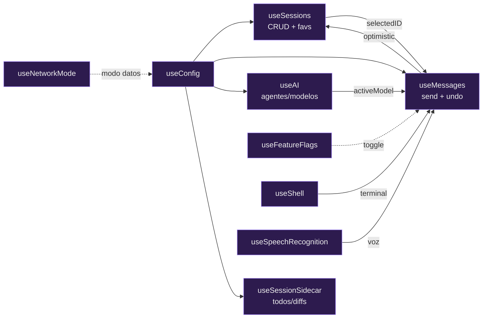
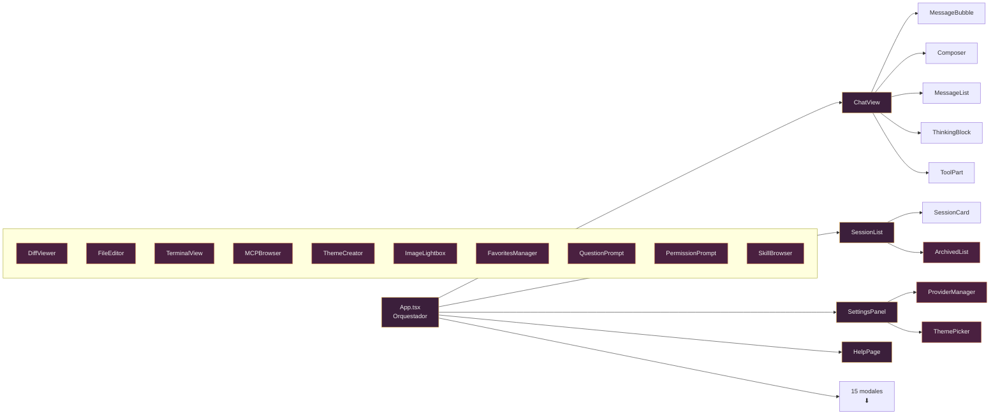
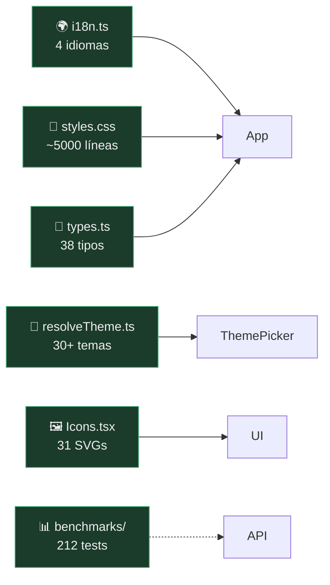

<div align="center">

  

# ⚡ OpenCode Mobile

**Cliente Android para [OpenCode](https://opencode.ai) — tu asistente de codificación AI desde el celular**

<p align="center">
  
  
  
  
  
  <br/>
  
  
  
  
</p>

</div>

---

## ✨ Características

<div class="features-grid">

| | |
|---|---|
| **⚡ Streaming en tiempo real** | Eventos SSE via `/event` — indicadores de escritura, entrega instantánea |
| **🔄 Polling adaptativo** | 4 modos: Full (3.5s), Saver (15s), Ultra (30s), Miser (60s). Cambio automático en datos móviles |
| **📦 Cache offline** | IndexedDB — navegá sesiones y mensajes sin conexión |
| **💬 Chat completo** | Enviá prompts, comandos, shell. Abortá, revertí, undo/redo |
| **📋 Diff viewer** | Diffs expandibles por archivo con carga inline de contenido |
| **📁 Gestión de sesiones** | Crear, renombrar, eliminar, favoritos, archivar, exportar snapshots |
| **🤖 Control de agentes AI** | Seleccioná y cambiá entre agentes/modelos por sesión |
| **🔌 Multi-proveedor** | Conectá proveedores externos (OpenAI, Anthropic, etc.) via API key |
| **📂 File browser** | Navegá archivos remotos del proyecto |
| **🌿 Git toolbar** | Stage, commit, estado de rama (ahead/behind) |
| **🎤 Entrada por voz** | Speech-to-text con Web Speech API + plugin nativo Capacitor |
| **🔐 Permisos y Preguntas** | Modales automáticos para preguntas del AI y permisos de herramientas |
| **🎨 30+ temas** | Modos oscuro, claro, sistema y programado; selector de variantes con preview |
| **🌍 i18n** | Español, English, Italiano, 繁體中文 |
| **📉 Auto-summarize** | Compactación automática cuando el contexto crece |
| **📋 Plan breakdown** | Visualización de tareas para flujos de orquestación AI |
| **⌨️ Atajos de teclado** | Tab + acciones para usuarios avanzados |
| **🚀 Deploy rápido** | Scripts de 1 comando para LAN (misma WiFi) o tunnel (cualquier red) |
| **📝 Editor de archivos** | Leer, editar y guardar archivos del proyecto |
| **🖼️ Lightbox de imágenes** | Vista completa con zoom y arrastre |
| **🧩 MCP Browser** | Explorá recursos MCP conectados |
| **📦 Cola offline** | Las acciones se encolan y reenvían al reconectar |
| **🎨 Creador de temas** | Editor visual de colores con exportación JSON |
| **⭐ Favoritos reordenables** | Arrastrá y soltá para ordenar |

</div>

---

## 🕸️ Grafos de dependencias

<details>
<summary><b>📡 Transporte</b> — SSE, polling, cache y cola offline</summary>


</details>

<details>
<summary><b>🧠 Estado</b> — hooks principales y sus relaciones</summary>


</details>

<details>
<summary><b>🖥️ UI</b> — App, vistas principales y modales</summary>


</details>

<details>
<summary><b>🔧 Transversal</b> — servicios compartidos</summary>


</details>

## 🚀 Inicio rápido

```bash
# Web preview
cd web
pnpm install
pnpm dev                # → http://localhost:5173

# Build APK completo
pnpm build && npx cap sync && cd android
.\gradlew assembleDebug

# O con deploy script
.\deploy-quick.ps1            # Misma WiFi
.\deploy-quick.ps1 -Tunnel    # Cualquier red
```

---

## 🖥️ Configurar el servidor

```bash
OPENCODE_SERVER_USERNAME=opencode \
OPENCODE_SERVER_PASSWORD=tu-contraseña \
npx -y opencode-ai serve --hostname 0.0.0.0 --port 4096
```

> 💡 El puerto `4096` se auto-asigna por defecto en la app.

---

## 🔗 Conectar desde cualquier red (Tailscale)

[Tailscale](https://tailscale.com) crea una VPN mesh segura — tu teléfono y PC se conectan via IP privada incluso en redes diferentes.

```bash
# En tu PC:
tailscale ip -4
# → 100.x.x.x

# Iniciar servidor en Tailscale IP:
OPENCODE_SERVER_USERNAME=opencode \
OPENCODE_SERVER_PASSWORD=tu-contraseña \
npx -y opencode-ai serve --hostname 100.x.x.x --port 4096
```

En el teléfono: **Host** = `100.x.x.x`, **Port** = `4096`, **Username/Password** = los mismos.

---

> 📖 **Catálogo completo**: [`CATALOGO.md`](CATALOGO.md) — 47 componentes, 27 hooks, 35 endpoints, grafos, guía para LLM.

## 📁 Estructura del proyecto

```
web/
├── src/
│   ├── components/       # 43 componentes UI
│   ├── hooks/            # 26 hooks React
│   ├── api.ts            # Cliente HTTP (30 endpoints)
│   ├── App.tsx           # Orquestador principal
│   ├── types.ts          # Tipos TypeScript
│   ├── i18n.ts           # 4 idiomas
│   └── styles.css        # Sistema de diseño completo
├── android/              # Proyecto nativo Android
```

---

## 🏗️ Arquitectura

| Principio | Descripción |
|-----------|-------------|
| **🔄 SSE + Polling handoff** | Cuando SSE está activo, el polling corre a 5s en vez del intervalo completo. Al desconectarse, el backoff entra inmediatamente |
| **📈 Backoff exponencial** | Polling empieza en 1s, se duplica por cada fallo hasta 60s, con 30% de jitter. SSE similar pero tope en 30s |
| **📦 Offline-first** | IndexedDB cachea sesiones + mensajes. Navegar datos antiguos funciona offline; las escrituras requieren conectividad |
| **⚡ Optimistic updates** | Los mensajes del usuario se renderizan inmediatamente antes del round-trip al servidor |
| **🛡️ Stale request rejection** | `loadSelected` usa un ID de request para descartar respuestas de polling obsoletas |
| **🎨 Temas dinámicos** | 30+ temas con variables CSS aplicadas en runtime via `resolveTheme.ts` |

---

<div align="center">

**OpenCode Mobile** es un cliente para [**OpenCode**](https://opencode.ai) — el asistente de codificación AI open-source.

Desarrollado por [@Owning01](https://github.com/Owning01) · [Reportar issue](https://github.com/Owning01/Opencode-Mobile/issues) · [Contribuir](https://github.com/Owning01/Opencode-Mobile)

</div>

