<div align="center">

# ⚡ OpenCode Mobile

**Cliente Android para [OpenCode](https://opencode.ai) — tu asistente de codificación AI desde el celular**

<p align="center">
  
  
  
  
  
  <br/>
  
  
  
  
</p>

</div>

---

## ✨ Características

<div class="features-grid">

| | |
|---|---|
| **⚡ Streaming en tiempo real** | Eventos SSE via `/event` — indicadores de escritura, entrega instantánea |
| **🔄 Polling adaptativo** | 4 modos: Full (3.5s), Saver (15s), Ultra (30s), Miser (60s). Cambio automático en datos móviles |
| **📦 Cache offline** | IndexedDB — navegá sesiones y mensajes sin conexión |
| **💬 Chat completo** | Enviá prompts, comandos, shell. Abortá, revertí, undo/redo |
| **📋 Diff viewer** | Diffs expandibles por archivo con carga inline de contenido |
| **📁 Gestión de sesiones** | Crear, renombrar, eliminar, favoritos, archivar, exportar snapshots |
| **🤖 Control de agentes AI** | Seleccioná y cambiá entre agentes/modelos por sesión |
| **🔌 Multi-proveedor** | Conectá proveedores externos (OpenAI, Anthropic, etc.) via API key |
| **📂 File browser** | Navegá archivos remotos del proyecto |
| **🌿 Git toolbar** | Stage, commit, estado de rama (ahead/behind) |
| **🎤 Entrada por voz** | Speech-to-text con Web Speech API + plugin nativo Capacitor |
| **🔐 Permisos y Preguntas** | Modales automáticos para preguntas del AI y permisos de herramientas |
| **🎨 30+ temas** | Modos oscuro, claro, sistema y programado; selector de variantes con preview |
| **🌍 i18n** | Español, English, Italiano, 繁體中文 |
| **📉 Auto-summarize** | Compactación automática cuando el contexto crece |
| **📋 Plan breakdown** | Visualización de tareas para flujos de orquestación AI |
| **⌨️ Atajos de teclado** | Tab + acciones para usuarios avanzados |
| **🚀 Deploy rápido** | Scripts de 1 comando para LAN (misma WiFi) o tunnel (cualquier red) |
| **📝 Editor de archivos** | Leer, editar y guardar archivos del proyecto |
| **🖼️ Lightbox de imágenes** | Vista completa con zoom y arrastre |
| **🧩 MCP Browser** | Explorá recursos MCP conectados |
| **📦 Cola offline** | Las acciones se encolan y reenvían al reconectar |
| **🎨 Creador de temas** | Editor visual de colores con exportación JSON |
| **⭐ Favoritos reordenables** | Arrastrá y soltá para ordenar |

</div>

---

## 🕸️ Grafo de dependencias

```mermaid
flowchart TB
    %% Estilos
    classDef infra fill:#1a1a2e,stroke:#6c8cff,color:#eee
    classDef core fill:#1e3a5f,stroke:#5ba3e6,color:#eee
    classDef hook fill:#2d1b4e,stroke:#a78bfa,color:#eee
    classDef ui fill:#3b1f3b,stroke:#f0c060,color:#eee
    classDef cross fill:#1b3b2b,stroke:#4caf7d,color:#eee

    %% === CAPA 0: Infraestructura ===
    subgraph Infraestructura["Infraestructura"]
        Server["🖥️ Servidor OpenCode<br/>(HTTP + SSE)"]
        API["🌐 api.ts<br/>30 endpoints REST"]
        Cap["⚡ Capacitor<br/>Plugins nativos"]
    end

    %% === CAPA 1: Transporte ===
    subgraph Transporte["Capa de Transporte"]
        SSE["useSSE.ts<br/>Streaming SSE"]
        Poll["usePolling.ts<br/>Backoff exponencial"]
        Cache["useOfflineCache.ts<br/>IndexedDB"]
        Queue["useOfflineQueue.ts<br/>Cola offline"]
    end

    %% === CAPA 2: Hooks de Estado ===
    subgraph Hooks["Capa de Estado & Lógica"]
        Msgs["useMessages.ts<br/>Chat + prompts + undo/redo"]
        Sess["useSessions.ts<br/>CRUD sesiones + favoritos"]
        AI["useAI.ts<br/>Agentes + modelos"]
        Config["useConfig.ts<br/>Config servidor + auth"]
        Sidecar["useSessionSidecar.ts<br/>Diffs + todos + dashboard"]
        Shell["useShell.ts<br/>Terminal"]
        Notif["useNotifications.ts<br/>Notificaciones push"]
        Deep["useDeepLink.ts<br/>Deep links"]
        Stats["useStats.ts<br/>Estadísticas de uso"]
        Flags["useFeatureFlags.ts<br/>Feature flags"]
        Net["useNetworkMode.ts<br/>Modo datos móvil/WiFi"]
        AutoSum["useAutoSummarize.ts<br/>Compactación automática"]
        Speech["useSpeechRecognition.ts<br/>Voz a texto"]
    end

    %% === CAPA 3: Componentes UI ===
    subgraph UI["Capa de Presentación"]
        App["App.tsx<br/>Orquestador principal"]
        Chat["💬 ChatView<br/>+ Composer + MessageList"]
        Sessions["📁 SessionList<br/>+ SessionCard"]
        Settings["⚙️ SettingsPanel<br/>+ ProviderManager"]

        subgraph Modales["Modales"]
            Diff["📋 DiffViewer"]
            Editor["📝 FileEditor"]
            Terminal["💻 TerminalView"]
            MCP["🧩 MCPBrowser"]
            Archive["📦 ArchivedList"]
            ThemePicker["🎨 ThemePicker"]
            ThemeCreate["🎨 ThemeCreator"]
            Lightbox["🖼️ ImageLightbox"]
            Shortcuts["⌨️ ShortcutsModal"]
            Favorites["⭐ FavoritesManager"]
            Question["🤔 AutoQuestionPrompt"]
            Permission["🔐 PermissionPrompt"]
            Skills["📚 SkillBrowser"]
        end

        subgraph Menus["Navegación"]
            Nav["NavBar"]
            Sheet["BottomSheet<br/>AI + Detalles"]
            Help["HelpPage"]
        end
    end

    %% === CAPA TRANSVERSAL ===
    subgraph Transversal["Servicios Transversales"]
        I18N["🌍 i18n.ts<br/>4 idiomas"]
        Themes["🎨 resolveTheme.ts<br/>30+ temas"]
        Styles["📄 styles.css<br/>~4900 líneas"]
        Types["📐 types.ts<br/>Tipos compartidos"]
        Icons["🖼️ Icons.tsx<br/>24 SVG icons"]
        Bench["📊 benchmarks/<br/>212 tests"]
    end

    %% === CONEXIONES ===
    Server --> API
    API --> SSE
    API --> Poll
    API --> Cache
    API --> Queue
    API --> Msgs
    API --> Sess
    API --> AI
    API --> Config
    API --> Sidecar
    API --> Shell
    Cap --> Speech
    Cap --> Deep

    SSE --> Msgs
    Poll --> Msgs
    Poll --> Sess
    Cache --> Sess
    Queue --> Msgs

    Msgs --> App
    Sess --> App
    AI --> App
    Config --> App
    Sidecar --> App
    Shell --> App
    Notif --> App
    Deep --> Config
    Stats --> App
    Flags --> App
    Net --> Poll
    AutoSum --> Msgs
    Speech --> Chat

    App --> Chat
    App --> Sessions
    App --> Settings
    App --> Nav
    App --> Sheet
    App --> Help
    App --> Diff
    App --> Editor
    App --> Terminal
    App --> MCP
    App --> Archive
    App --> ThemePicker
    App --> ThemeCreate
    App --> Lightbox
    App --> Shortcuts
    App --> Favorites
    App --> Question
    App --> Permission
    App --> Skills

    I18N --> App
    Themes --> ThemePicker
    Themes --> ThemeCreate
    Types --> App
    Icons --> Chat
    Icons --> Settings
    Icons --> Sessions
    Styles --> App
    Bench -.-> API
    Bench -.-> Poll
    Bench -.-> SSE
    Bench -.-> Cache

    %% Links
    click SSE "https://github.com/Owning01/Opencode-Mobile/blob/main/web/src/hooks/useSSE.ts"
    click Poll "https://github.com/Owning01/Opencode-Mobile/blob/main/web/src/hooks/usePolling.ts"
    click Cache "https://github.com/Owning01/Opencode-Mobile/blob/main/web/src/hooks/useOfflineCache.ts"
    click Queue "https://github.com/Owning01/Opencode-Mobile/blob/main/web/src/hooks/useOfflineQueue.ts"
    click Msgs "https://github.com/Owning01/Opencode-Mobile/blob/main/web/src/hooks/useMessages.ts"
    click Shell "https://github.com/Owning01/Opencode-Mobile/blob/main/web/src/hooks/useShell.ts"
    click Diff "https://github.com/Owning01/Opencode-Mobile/blob/main/web/src/components/DiffViewer.tsx"
    click Editor "https://github.com/Owning01/Opencode-Mobile/blob/main/web/src/components/FileEditor.tsx"
    click Terminal "https://github.com/Owning01/Opencode-Mobile/blob/main/web/src/components/TerminalView.tsx"
    click API "https://github.com/Owning01/Opencode-Mobile/blob/main/web/src/api.ts"
```



## 🚀 Inicio rápido

```bash
# Web preview
cd web
pnpm install
pnpm dev                # → http://localhost:5173

# Build APK completo
pnpm build && npx cap sync && cd android
.\gradlew assembleDebug

# O con deploy script
.\deploy-quick.ps1            # Misma WiFi
.\deploy-quick.ps1 -Tunnel    # Cualquier red
```

---

## 🖥️ Configurar el servidor

```bash
OPENCODE_SERVER_USERNAME=opencode \
OPENCODE_SERVER_PASSWORD=tu-contraseña \
npx -y opencode-ai serve --hostname 0.0.0.0 --port 4096
```

> 💡 El puerto `4096` se auto-asigna por defecto en la app.

---

## 🔗 Conectar desde cualquier red (Tailscale)

[Tailscale](https://tailscale.com) crea una VPN mesh segura — tu teléfono y PC se conectan via IP privada incluso en redes diferentes.

```bash
# En tu PC:
tailscale ip -4
# → 100.x.x.x

# Iniciar servidor en Tailscale IP:
OPENCODE_SERVER_USERNAME=opencode \
OPENCODE_SERVER_PASSWORD=tu-contraseña \
npx -y opencode-ai serve --hostname 100.x.x.x --port 4096
```

En el teléfono: **Host** = `100.x.x.x`, **Port** = `4096`, **Username/Password** = los mismos.

---

## 📁 Estructura del proyecto

```
web/
├── src/
│   ├── components/       # 43 componentes UI
│   ├── hooks/            # 26 hooks React
│   ├── benchmarks/       # 212 tests de velocidad
│   ├── api.ts            # Cliente HTTP (30 endpoints)
│   ├── App.tsx           # Orquestador principal
│   ├── types.ts          # Tipos TypeScript
│   ├── i18n.ts           # 4 idiomas
│   └── styles.css        # Sistema de diseño completo
├── android/              # Proyecto nativo Android
└── benchmarks/           # Suite de benchmarks
```

---

## ⚡ Performance

Suite de benchmarks: **212 tests, 68 grupos** — ejecutar con `pnpm benchmark`

| Capa | Más rápido | Típico | Cuello de botella |
|------|-----------|--------|-------------------|
| **SSE parsing** | 4ns/evento | 11µs (10 eventos) | 707µs (1000 eventos — irreal) |
| **Backoff calc** | 261ns | 1µs | ❌ Ninguno |
| **i18n lookup** | 56ns | 360ns | ❌ Ninguno |
| **Cache Map.get** | 24ns | 2µs (1000 gets) | ❌ Ninguno |
| **Session filter** | 18ns (vacío) | 10µs (100 sesiones) | 489µs (10000 sesiones) |
| **Message render** | 710ns (4 parts) | 34µs (200 msgs) | ❌ Ninguno |
| **Diff parse** | 1µs (50 lines) | 132µs (5000 lines) | ❌ Ninguno |
| **JSON serialize** | 1.7µs (1 sesión) | 250µs (100 sesiones) | ❌ Ninguno |
| **Virtual list** | 4ns | 90ns | ❌ Ninguno |

> ✅ Todas las operaciones críticas completan en **microsegundos o nanosegundos**. La app está limitada por GPU/red, no por CPU.

---

## 🏗️ Arquitectura

| Principio | Descripción |
|-----------|-------------|
| **🔄 SSE + Polling handoff** | Cuando SSE está activo, el polling corre a 5s en vez del intervalo completo. Al desconectarse, el backoff entra inmediatamente |
| **📈 Backoff exponencial** | Polling empieza en 1s, se duplica por cada fallo hasta 60s, con 30% de jitter. SSE similar pero tope en 30s |
| **📦 Offline-first** | IndexedDB cachea sesiones + mensajes. Navegar datos antiguos funciona offline; las escrituras requieren conectividad |
| **⚡ Optimistic updates** | Los mensajes del usuario se renderizan inmediatamente antes del round-trip al servidor |
| **🛡️ Stale request rejection** | `loadSelected` usa un ID de request para descartar respuestas de polling obsoletas |
| **🎨 Temas dinámicos** | 30+ temas con variables CSS aplicadas en runtime via `resolveTheme.ts` |

---

## 🧪 Benchmarks

```bash
pnpm benchmark                  # Ejecutar los 212 tests
pnpm benchmark:report           # Guardar en benchmarks/report.txt
```

Cobertura: parsing SSE, algoritmos de backoff, escenarios de polling, cadenas de API calls, escritura/lectura IndexedDB, búsqueda i18n, renderizado de mensajes, parsing de diffs, transformación de sesiones, transformación de proveedores, listas virtuales, detección de bloques de código y 8 escenarios de integración.

---

## 🧰 Plugins de Capacitor Instalados

| Plugin | Versión | Propósito |
|--------|---------|-----------|
| `@capacitor-community/speech-recognition` | 7.0.1 | Reconocimiento de voz nativo |
| `@capacitor/app` | 8.1.1 | Manejo de ciclo de vida y deep links |
| `@capacitor/camera` | 8.2.1 | Captura de imágenes |
| `@capacitor/dialog` | 8.0.1 | Diálogos nativos |
| `@capacitor/filesystem` | 8.1.2 | Persistencia de archivos |
| `@capacitor/network` | 8.0.1 | Detección de cambios de red |

---

## 📜 Licencia

MIT — hecho por [@Owning01](https://github.com/Owning01)
