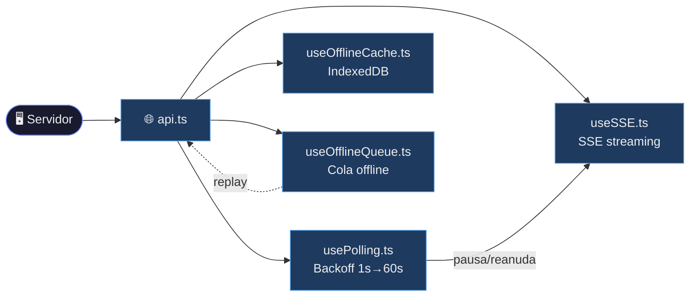
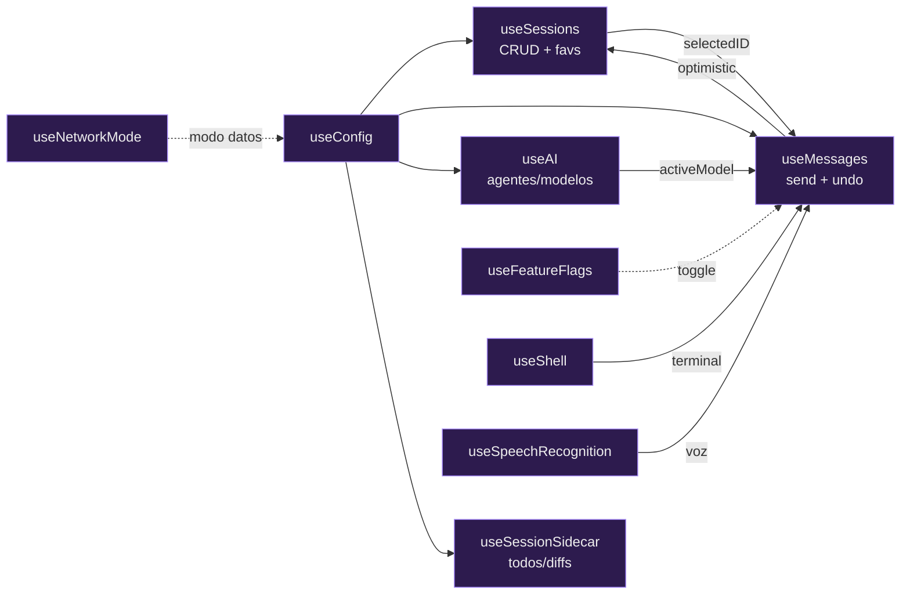
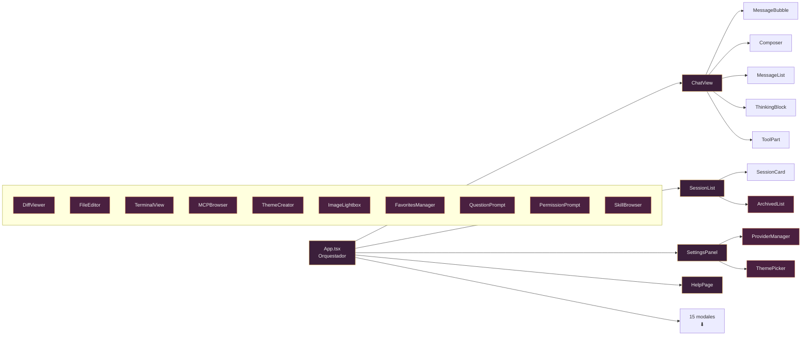
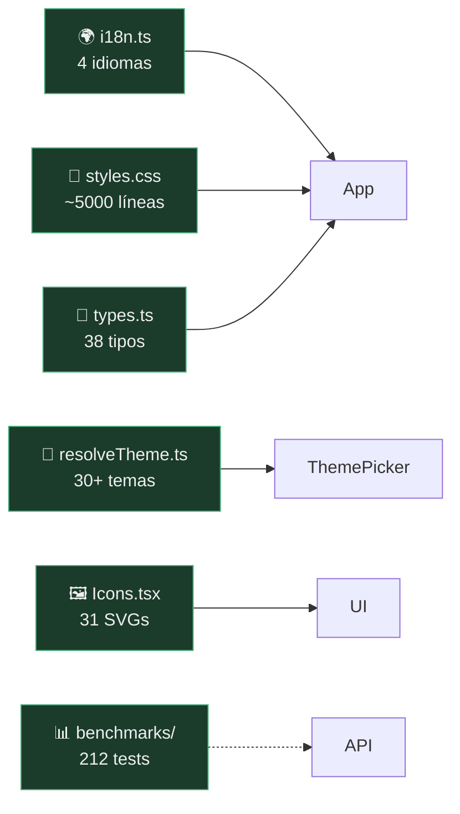

<div align="center">

  

# OpenCode Mobile

**Cliente Android/iOS para [OpenCode](https://opencode.ai) — tu asistente de codificación AI desde el celular**

<p align="center">
  
  
  
  
  
  <br/>
  
  
  
  
</p>

</div>

---

## ✨ Características

<div class="features-grid">

| | |
|---|---|
| **⚡ Streaming en tiempo real** | Eventos SSE via `/event` — indicadores de escritura, entrega instantánea |
| **🔄 Polling adaptativo** | 4 modos: Full (3.5s), Saver (15s), Ultra (30s), Miser (60s). Cambio automático en datos móviles |
| **📦 Cache offline** | IndexedDB — navegá sesiones y mensajes sin conexión |
| **💬 Chat completo** | Enviá prompts, comandos, shell. Abortá, revertí, undo/redo |
| **📋 Diff viewer** | Diffs expandibles por archivo con carga inline de contenido |
| **📁 Gestión de sesiones** | Crear, renombrar, eliminar, favoritos, archivar, exportar snapshots |
| **🤖 Control de agentes AI** | Seleccioná y cambiá entre agentes/modelos por sesión |
| **🔌 Multi-proveedor** | Conectá proveedores externos (OpenAI, Anthropic, etc.) via API key |
| **📂 File browser** | Navegá archivos remotos del proyecto |
| **🌿 Git toolbar** | Stage, commit, estado de rama (ahead/behind) |
| **🎤 Entrada por voz** | Speech-to-text con Web Speech API + plugin nativo Capacitor |
| **🔐 Permisos y Preguntas** | Modales automáticos para preguntas del AI y permisos de herramientas |
| **🎨 30+ temas** | Modos oscuro, claro, sistema y programado; selector de variantes con preview |
| **🌍 i18n** | Español, English, Italiano, 繁體中文 |
| **📉 Auto-summarize** | Compactación automática cuando el contexto crece |
| **📋 Plan breakdown** | Visualización de tareas para flujos de orquestación AI |
| **⌨️ Atajos de teclado** | Tab + acciones para usuarios avanzados |
| **🚀 Deploy rápido** | Scripts de 1 comando para LAN (misma WiFi) o tunnel (cualquier red) |
| **📝 Editor de archivos** | Leer, editar y guardar archivos del proyecto |
| **🖼️ Lightbox de imágenes** | Vista completa con zoom y arrastre |
| **🧩 MCP Browser** | Explorá recursos MCP conectados |
| **📦 Cola offline** | Las acciones se encolan y reenvían al reconectar |
| **🎨 Creador de temas** | Editor visual de colores con exportación JSON |
| **⭐ Favoritos reordenables** | Arrastrá y soltá para ordenar |

</div>

---

## 🕸️ Grafos de dependencias

<details>
<summary><b>📡 Transporte</b> — SSE, polling, cache y cola offline</summary>


</details>

<details>
<summary><b>🧠 Estado</b> — hooks principales y sus relaciones</summary>


</details>

<details>
<summary><b>🖥️ UI</b> — App, vistas principales y modales</summary>


</details>

<details>
<summary><b>🔧 Transversal</b> — servicios compartidos</summary>


</details>

## 🚀 Empezar en 2 pasos

### 📲 1 — Instalá la app en tu celular

[⬇️ **Descargar OpenCodeMobile.apk**](https://github.com/Owning01/Opencode-Mobile/releases/latest)

O construíla vos mismo (ver [desarrollo](#-desarrollo)).

**iOS** (requiere macOS + Xcode 16+): cloná el repo y abrí `web/ios/App/App.xcworkspace` en Xcode, seleccioná tu team de desarrollo y Build & Run.

---

### 🖥️ 2 — Descargá **opencode-tunnel.exe** y ejecutalo

[⬇️ **Descargar opencode-tunnel.exe**](https://github.com/Owning01/Opencode-Mobile/releases/latest)

Al ejecutarlo se abre el navegador con esta interfaz:

```
┌─ OpenCode Tunnel ──────────────────────────────┐
│  Nombre del túnel: [MiOficina       ]           │
│  Contraseña:       [••••••••        ]           │
│                                                  │
│  [CONECTAR]  ← un solo botón hace todo          │
│                                                  │
│  ● Servidor: detectado · Túnel: conectado       │
│  [12:00] Servidor iniciado automáticamente       │
│  [12:01] Cliente conectado desde remoto          │
└──────────────────────────────────────────────────┘
```

**El tunnel hace todo solo**:
- ✅ Busca OpenCode en tu PC y lo inicia si no está corriendo
- ✅ Conecta el túnel para que tu celular acceda desde cualquier red
- ✅ Se guarda la configuración para la próxima vez

Solo necesitas poner un **nombre** y **contraseña** (los mismos que vas a usar en el celular).

---

### 📱 En el celular: abrí la app

**Ajustes → Conexión Remota** → poné el mismo nombre y contraseña → **Conectar**.

✓ Listo. Ya podés usar OpenCode desde cualquier lugar.

---

> 💡 **¿No querés usar el túnel?** También podés conectar por WiFi local:
> 1. En PC: `npx -y opencode-ai serve --hostname 0.0.0.0 --port 4096`
> 2. En la app: **Ajustes → Servidor**, poné la IP de tu PC
>
> O con Tailscale: instalalo en PC y celular, usá la IP de Tailscale en vez de la local.

---

## 📱 Datos móviles / Mobile Data

La app ajusta automáticamente el modo al detectar datos móviles (cellular → Reducido, WiFi → Full).
También podés cambiarlo manualmente en **Ajustes**.

| Modo | Polling | KB/min (idle) | ~30 min | Ideal para |
|------|---------|---------------|---------|------------|
| **Full** | 3.5s | ~35 KB | ~1 MB | WiFi ilimitado · streaming SSE en tiempo real con audio |
| **Balance** | 15s | ~10 KB | ~300 KB | WiFi o datos generosos · payload completo + notificaciones |
| **Reducido** | 30s | ~3.6 KB | ~108 KB | 4G/LTE · sin audio ni tool parts · solo polling si activa |
| **Mínimo** | 60s | ~1.8 KB | ~54 KB | Datos limitados o roaming · solo texto, sin notificaciones |

Durante generación activa el consumo puntual se multiplica 2-3× por unos segundos (respuesta con tool calls).
Cifras estimadas sobre HTTP/2 comprimido con ~10 sesiones en el servidor.

The app auto-switches on cellular (→ Reduced) or WiFi (→ Full). Manual override in **Settings**.

| Mode | Polling | KB/min (idle) | ~30 min | Best for |
|------|---------|---------------|---------|----------|
| **Full** | 3.5s | ~35 KB | ~1 MB | Unlimited WiFi · real-time SSE streaming with audio |
| **Balance** | 15s | ~10 KB | ~300 KB | WiFi or generous data · full payload + notifications |
| **Reduced** | 30s | ~3.6 KB | ~108 KB | 4G/LTE · no audio or tool parts · polls only when active |
| **Miser** | 60s | ~1.8 KB | ~54 KB | Limited data or roaming · text only, no notifications |

During active generation, consumption can spike 2-3× for seconds (response with tool calls).
Estimates over compressed HTTP/2 with ~10 server sessions.

---

> 📖 **Catálogo completo**: [`CATALOGO.md`](CATALOGO.md) — 47 componentes, 27 hooks, 35 endpoints, grafos, guía para LLM.

## 📁 Estructura del proyecto

```
web/
├── src/
│   ├── components/       # 43 componentes UI
│   ├── hooks/            # 26 hooks React
│   ├── api.ts            # Cliente HTTP (30 endpoints)
│   ├── App.tsx           # Orquestador principal
│   ├── types.ts          # Tipos TypeScript
│   ├── i18n.ts           # 4 idiomas
│   └── styles.css        # Sistema de diseño completo
├── android/              # Proyecto nativo Android
├── ios/                  # Proyecto nativo iOS (Xcode)
```

---

## 🏗️ Arquitectura

| Principio | Descripción |
|-----------|-------------|
| **🔄 SSE + Polling handoff** | Cuando SSE está activo, el polling corre a 5s en vez del intervalo completo. Al desconectarse, el backoff entra inmediatamente |
| **📈 Backoff exponencial** | Polling empieza en 1s, se duplica por cada fallo hasta 60s, con 30% de jitter. SSE similar pero tope en 30s |
| **📦 Offline-first** | IndexedDB cachea sesiones + mensajes. Navegar datos antiguos funciona offline; las escrituras requieren conectividad |
| **⚡ Optimistic updates** | Los mensajes del usuario se renderizan inmediatamente antes del round-trip al servidor |
| **🛡️ Stale request rejection** | `loadSelected` usa un ID de request para descartar respuestas de polling obsoletas |
| **🎨 Temas dinámicos** | 30+ temas con variables CSS aplicadas en runtime via `resolveTheme.ts` |

---

<div align="center">

**OpenCode Mobile** es un cliente para [**OpenCode**](https://opencode.ai) — el asistente de codificación AI open-source.

Desarrollado por [@Owning01](https://github.com/Owning01) · [Reportar issue](https://github.com/Owning01/Opencode-Mobile/issues) · [Contribuir](https://github.com/Owning01/Opencode-Mobile)

</div>

